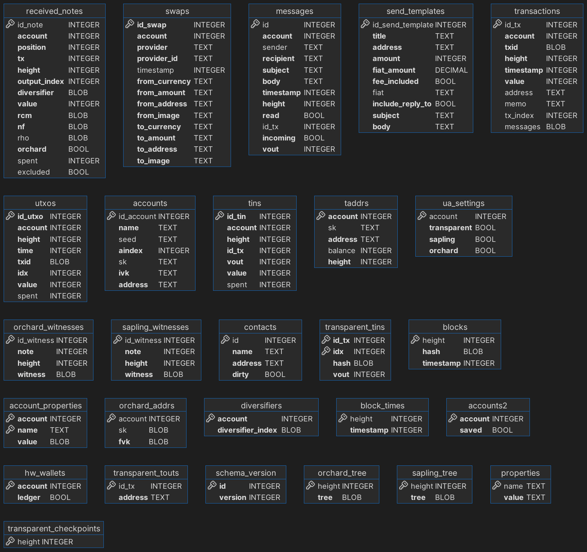

# YWallet

YWallet stores it's data in an sqlite database.

Here's an ER Diagram of the database schema:



## Objects Stored

### Account

```rust
name: TEXT NOT NULL
seed: TEXT
account_index: INTEGER NOT NULL
spending_key: TEXT
incoming_viewing_key: TEXT NOT NULL UNIQUE
address: TEXT NOT NULL,
diversifiers: ARRAY(INTEGER)
```

### Transaction

```rust
account: Account NOT NULL
txid: BLOB NOT NULL
height: INTEGER NOT NULL
timestamp: INTEGER NOT NULL
value: INTEGER NOT NULL
address: TEXT
memo: TEXT
tx_index: INTEGER
```

With:

```rust
(height, tx_index, account) UNIQUE
```

### Block

```rust
height: INTEGER NOT NULL
hash: BLOB NOT NULL
timestamp: INTEGER NOT NULL
sapling_tree: BLOB NOT NULL
```
